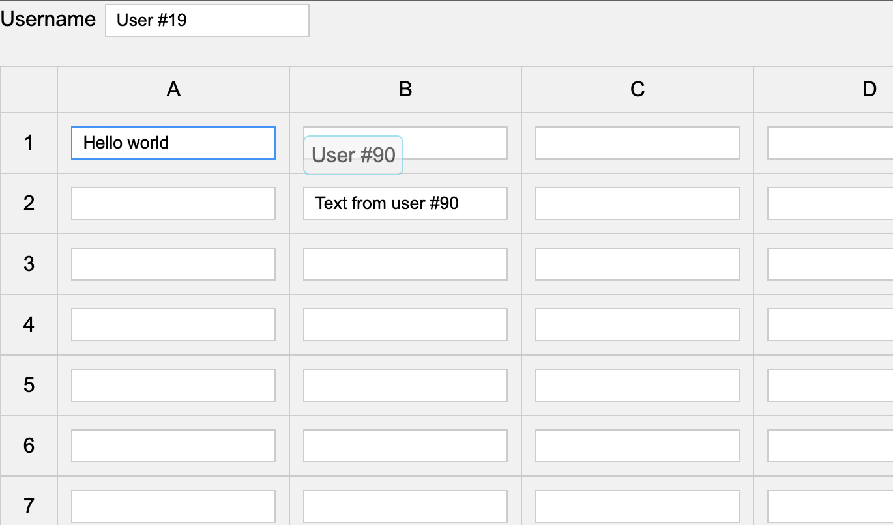

Projects:
- [x] Simple Minimalistinc Chat. Client Html . Server express.js
- [] Feathers.js example (not started)
- [] Collaborative wysiwyg editor (not started)
- [] Realtime collaborative drawing (not started)
- [] Realtime dashboard (not started)

Table of Projects
-----------------
| Project | Description                                                                                                                                                                                                              | Status      |
| ------- |--------------------------------------------------------------------------------------------------------------------------------------------------------------------------------------------------------------------------|-------------|
| [Simple Minimalistinc Chat](./projects/socketio-minimalistic) | Minimalistic example of a socket.io server and client.                                                                                                                                                                   | Done        |
| [Collaborative Table](./projects/collaborate-tables) | Collaborative table that allows multiple users to edit the same table at the same time. It is built using vanilla.js and vanilla node.js                   | Done        |
| [Feathers.js](./projects/feathersjs) | Simple example of a feathers.js server and client.                                                                                                                                                                       | In progress |
| [Collaborative Wysiwyg Editor](./projects/collaborate-wysiwyg) | Collaborative wysiwyg editor that allows multiple users to edit the same document at the same time. It is built using vanilla.js and vanilla node.js  | Not started |
| [Realtime Collaborative Drawing](./projects/collaborate-drawing) | Collaborative drawing that allows multiple users to draw on the same canvas at the same time. It is built using vanilla.js and vanilla node.js        |  Not started |
| [Realtime Dashboard](./projects/realtime-dashboard) | Realtime dashboard that allows multiple users to view the same dashboard at the same time. It is built using vanilla.js and vanilla node.js        | Not started |

